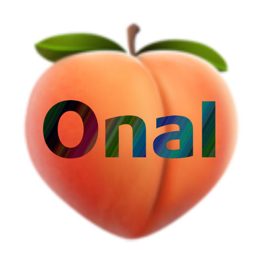

<p align="center" width="10%">
    
</p>

# <p align="center">OnalBot</p>

<br><p align="center" width="100%">
<a href="https://www.buymeacoffee.com/kimsec">
  </a></p>
<p align="center">
    <a href="https://github.com/Kimsec/OnalBot">
    </a>
    <a href="https://github.com/Kimsec/OnalBot?tab=readme-ov-file#quick-setup">
    </a>
</p>

## What Is OnalBot?

OnalBot is a self-hosted Discord music bot built with `discord.py`, `Pomice`, and `Lavalink`.
It is designed to be simple to run, fast to use, and comfortable to control in-chat with embeds, queue tools, and player buttons.

Drop in a normal search, a YouTube URL, a Spotify link, or an Apple Music track link, and the bot resolves it into playable audio with local caching to keep lookups snappy.

## Highlights

- `Pomice + Lavalink` playback with current Discord voice handling
- Clean queue system with now-playing embeds and button controls
- Spotify track and playlist resolving
- Apple Music track link lookup
- Local SQLite cache for Spotify and YouTube lookups
- Admin utilities like `!reset`, `!healthcheck`, `!showcache`, and `!clearcache`
- Optional welcome-card image generation for a selected server

## Core Commands

- `!play` / `!p` to play or queue music
- `!queue`, `!remove`, `!prioritize`, `!shuffle`, `!clearqueue` to manage the queue
- `!reset`, `!healthcheck`, `!showcache`, `!clearcache` for maintenance and status
- Player buttons for pause/resume, skip, stop, queue view, and queue removal

## Quick Setup

1. Clone the repo and install dependencies:

```bash
git clone https://github.com/Kimsec/OnalBot.git
cd OnalBot
python -m venv .venv
source .venv/bin/activate
pip install -r requirements.txt
```

Windows PowerShell:

```powershell
python -m venv .venv
.venv\Scripts\Activate.ps1
pip install -r requirements.txt
```

2. Copy `.env.example` to `.env` and fill in your values:

```env
DISCORD_TOKEN=your-bot-token
SPOTIFY_CLIENT_ID=your-client-id
SPOTIFY_CLIENT_SECRET=your-client-secret
LAVALINK_URI=http://127.0.0.1:2333
LAVALINK_PASSWORD=your-password
ALLOWED_GUILD_IDS=214461949574905857,1064940616208883792
FONT_PATH=./arial.ttf
```

3. Start your Lavalink server and make sure the URI and password match.

4. Start the bot:

```bash
python OnalBot.py
```

## Notes

- Leave `ALLOWED_GUILD_IDS` empty if you do not want to restrict the bot to specific servers.
- Spotify credentials are optional unless you want Spotify URL resolving.
- Apple Music support currently targets track links.
- `WELCOME_GUILD_ID` is optional and only used for the welcome-card feature.
- Cached lookups are stored in `music_cache.db`.
